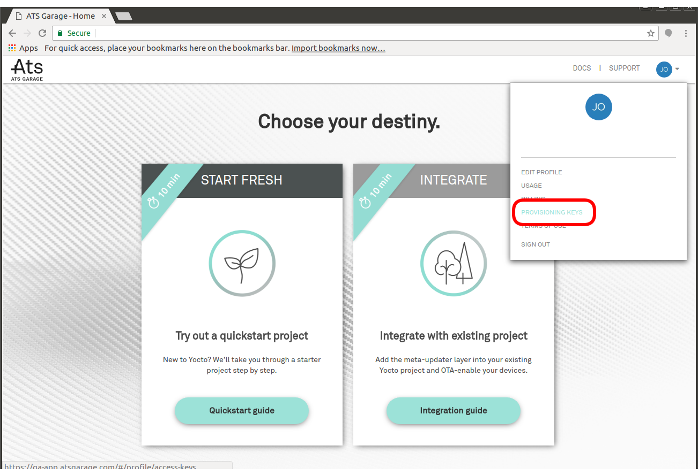
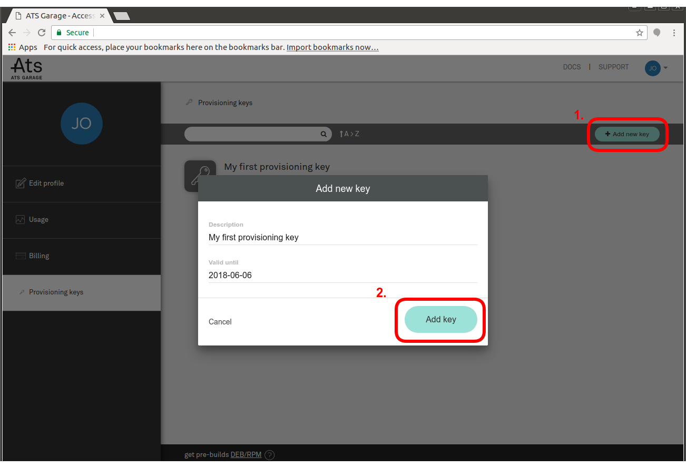

= Raspberry Pi
:page-layout: page
:page-categories: [quickstarts]
:page-date: 2017-05-16 15:48:37
:page-order: 1
:icons: font
:toc: macro

ATS Garage lets you easily manage OTA updates to embedded devices running custom-built Yocto images. This is a guide for building a simple Yocto image for the Raspberry Pi. You can use it as a base image for another project, or as a template for how to get started. The whole process only takes about 3 minutes of your time--watch the video guide to see just how easy it is.

toc::[]

== Video guide

video::228062652[vimeo,854,480]

== 0. Prerequisites

You'll need a Raspberry Pi Model 3, and a build machine with the following:

* A x86-64 Linux distro link:http://www.yoctoproject.org/docs/2.2/ref-manual/ref-manual.html#detailed-supported-distros[supported by the Yocto project] with the link:http://www.yoctoproject.org/docs/current/ref-manual/ref-manual.html#required-packages-for-the-host-development-system[required packages] installed. (On a Debian-based system, you should be able to install all the required packages with `sudo apt-get install gawk wget git-core diffstat unzip texinfo gcc-multilib build-essential chrpath socat libsdl1.2-dev xterm repo`.)
** Many/most distros that aren't on the officially supported list will still work just fine, but YMMV.
** Although the Yocto project as a whole does support architectures other than x86-64 for the build machine, one of the layers we'll be using only supports x86-64.
** You *can* run this all inside a VM, but a Yocto build is a pretty resource-intensive process, so generally we don't recommend it. If you do, make sure there's plenty of ram and disk space available to the VM.
* 100GB of free disk space
* link:https://android.googlesource.com/tools/repo/[repo]
** link:https://source.android.com/source/downloading#installing-repo[Download the latest version] directly from Google, or
** install it from your distro's packages if available (`apt-get install repo`)

== 1. Generate provisioning credentials

**Device Provisioning** is the process of attaching individual credentials and certificates to a device. ATS Garage automates this process for you, allowing you to use the same unmodified disk image on many different devices and registering each one with ATS Garage the first time it boots.

Go to the https://app.atsgarage.com/#/profile/access-keys[**Provisioning Keys**, window="_blank"] tab of your profile.

Create a new key, select its period of validity, and then download it.

It comes as a zip file containing a provisioning key and credentials for your build system to publish images. You don't need to unzip it; just save it somewhere. You'll need it when you set up your Yocto build.

== 2. Create your Yocto build environment

First, clone a manifest file for the quickstart project:

----
mkdir myproject
cd myproject
repo init -u https://github.com/advancedtelematic/updater-repo.git
repo sync
----

This will download the basic Yocto layers you need.

.What is this actually doing?
****
Yocto is a set of tools, templates and methods for building Linux systems from scratch. Most Yocto-built systems use a common set of base layers. The Yocto project maintains a *reference distribution* called Poky; we include that as a base layer, then add layers containing hardware support for specific boards (in this case the Raspberry Pi). Finally, we include a layer called meta-rust allowing us to compile the ATS Garage client (written in https://www.rust-lang.org/[Rust]), and the *meta-updater* layer containing the ATS Garage client and supporting tooling.

All of these layers are assembled into a built Linux system by Bitbake, the build tool of the Yocto Project, based on the instructions in the recipes inside the layers.
****

Now you can run the following script to get the environment set up:

----
source meta-updater/scripts/envsetup.sh raspberrypi3
----

== 3. Customize your build

The environment setup script will have created a build directory and placed you in it. It also generates a configuration file, located at `conf/local.conf`. This file is where we'll make our modifications to the base config.

=== Mandatory configuration keys

There are two things that are mandatory to change: you need to select a client to installfootnote:[ATS develops two open source clients compatible with ATS Garage, one written in Rust called rvi-sota-client, and one written in C++ called aktualizr. We'll use the Rust client for now; it gets the newest features first, and currently is the only one of the two that fully supports Uptane updates.], and add the provisioning credentials bundle you downloaded earlier. Add the following two lines to your local.conf:

----
SOTA_PACKED_CREDENTIALS = "/path/to/your/credentials.zip"
SOTA_CLIENT = "rvi-sota-client"
----

=== Optional configuration keys

* *Set image name*

When you build a filesystem image, it gets automatically uploaded to ATS Garage. By default, the image will be named `{MACHINE}-ota`, and you'll see the various versions of the image under that name. You can also choose to set your own name as follows:

----
OSTREE_BRANCHNAME = "my-super-great-project"
----

* *Persistent Yocto shared state cache and download directory*

Yocto caches its build artefacts to speed up future builds. By default, these are stored under the build directory of the current project. However, if you're planning to build several different projects that have some shared base files, you might want them to share their cache directories, both to save space and speed up your builds. You can do that as follows:

----
SSTATE_DIR = "/path/to/your/shared-sstate"
DL_DIR = "/path/to/your/shared-download"
----

* *Remote Yocto shared state cache*

Yocto also supports the use of remote caches. ATS provides one; you can configure your build to use it as follows:

----
SSTATE_MIRRORS ?= "file://.* https://bitbake-cache.atsgarage.com/PATH;downloadfilename=PATH"
----

This will save you some compilation time, as bitbake downloads some intermediate build artefacts instead of building them itself.

* *Add extra packages*

There are quite a lot of packages available to install that aren't installed by default. You can add extra packages to your image with *IMAGE_INSTALL_append*; for example, this will install vim:

----
IMAGE_INSTALL_append = " vim " <1>
----
<1> Note the spaces before and after the package name. This option dumbly appends a string to an install list, so we wrap it in spaces to make sure we don't alter the list in unexpected ways.

You can get a list of all the available packages in the layers you have configured with `bitbake-layers show-recipes`

== 4. Bitbake

Now you're ready to build an image.

----
bitbake rpi-basic-image
----

image::https://imgs.xkcd.com/comics/compiling.png[float="left",align="center"]

This step will take a while. If you used the build mirror, it might be as little as 10-15 minutes. Building everything from scratch, it will likely take a few hours.

== 5. Put the built image on an SD card

The build process creates disk images as an artefact. The one you need to write to the disk is located under your build directory at `tmp/deploy/images/raspberrypi3/rpi-basic-image-raspberrypi3.rpi-sdimg-ota`. We provide a script to write the image and resize it to fit your SD card:

----
sudo ../meta-updater-raspberrypi/scripts/flash-image.sh <device> <1>
----
<1> <device> is the name of the the device you want to write to. For example, `sdb`.

TIP: You can also write the image using `dd`, but since the wrong kind of typo in a dd command is so dangerous, we don't recommend it. If you really want to do it that way, though, inspect the shell script to find the required commands.

Now, put the card into your Pi, plug it into a *wired* internet connection, and power it on. You should see it come online in a minute or two. It will generate a random name for itself during autoprovisioning; you can change the name later.

[discrete]
== link:../quickstarts/pushing-updates.html[Next: Pushing your first update >>]
