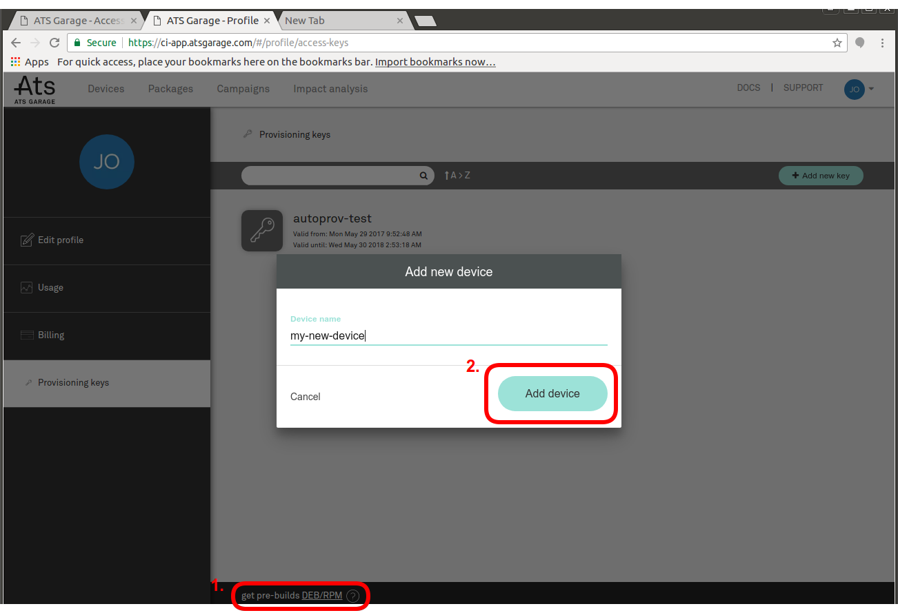
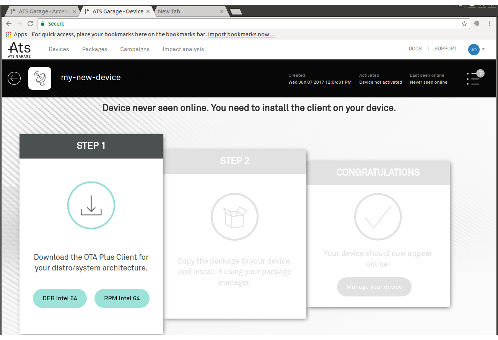

= Install from a pre-built .deb or .rpm package
:page-layout: default
:page-categories: [quickstarts]
:page-date: 2017-05-24 11:15:57
:page-order: 10
:icons: font

== Installation from pre-built packages

It's possible to use ATS Garage as a front-end/web interface for package management, without any of the Yocto support. To use this option, first go to the **Provisioning Keys** tab of your profile.

image::../images/provisioning-key-menu.png[]

Then, you can manually create a device and download a pre-built package for it with device credentials baked in. From the provisioning page, click *get pre-builds DEB/RPM*, and name your device.

This will take you to the device page:

From there, just download a deb or rpm (x86-64 only, sorry) and install it on your target machine. Remember, this package has device credentials baked in, so it can only be installed on a single machine.

