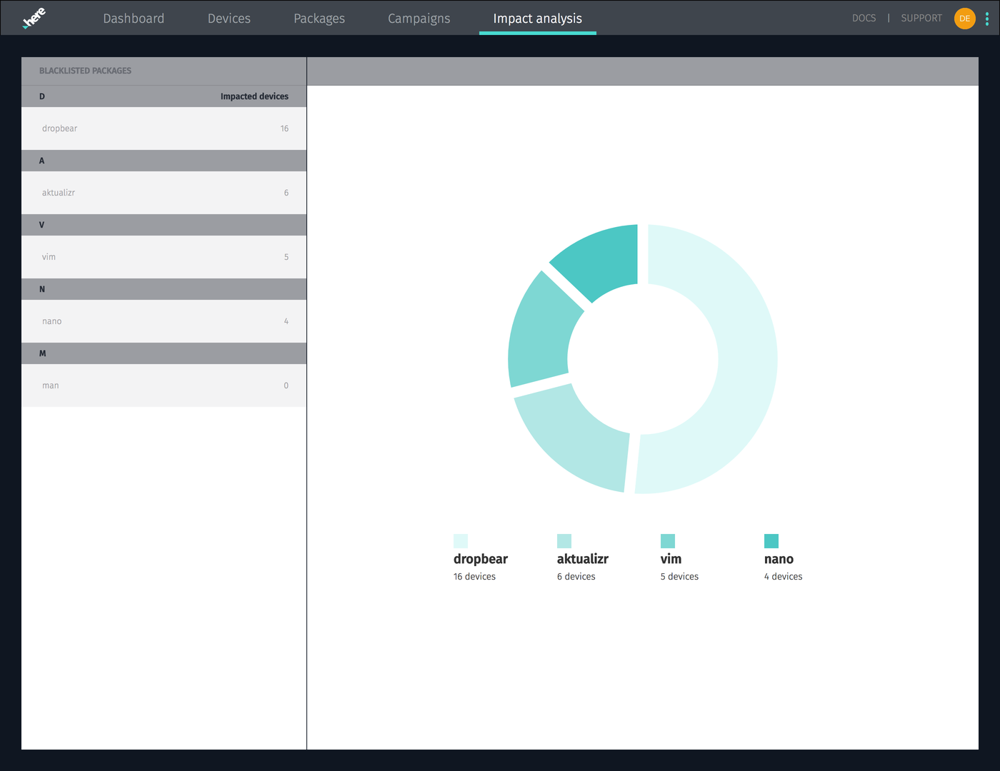

= Blacklisting/Impact analysis
:page-layout: page
:page-categories: [usage]
:page-date: 2017-06-07 13:52:30
:page-order: 4
:icons: font

Often, the reason you need to run an update campaign is that you've discovered a bug or security hole in something that's currently deployed. {product-name} lets you blacklist packages and images, and shows you how many of your devices are affected by the blacklisted version.

It's important to understand the distinction here between a package and an image. {product-name-short}, by default, manages full filesystem images built by Yocto. Each filesystem image also has a manifest of the software packages installed on it.

You can blacklist either an image or a package. Either way, the *Impact Analysis* tab will report how many of your devices are affected by the packages you've blacklisted.

== Blacklisting a package

To blacklist an individual package, go to the link:../usage/device-page.html[device page] of a device that has the package installed, click the image that contains the package, find it in the list, and click the ban icon:

== Blacklisting an image

To blacklist a whole image, just click the ban icon next to the image.

== Impact analysis

The {app-url}/#/impact-analysis[*Impact analysis* tab, window="_blank"] lets you view stats about the impact of packages you've blacklisted to help you make decisions about your update priorities. Results are dynamically updated as your vehicles complete update campaigns.

.Impact analysis

