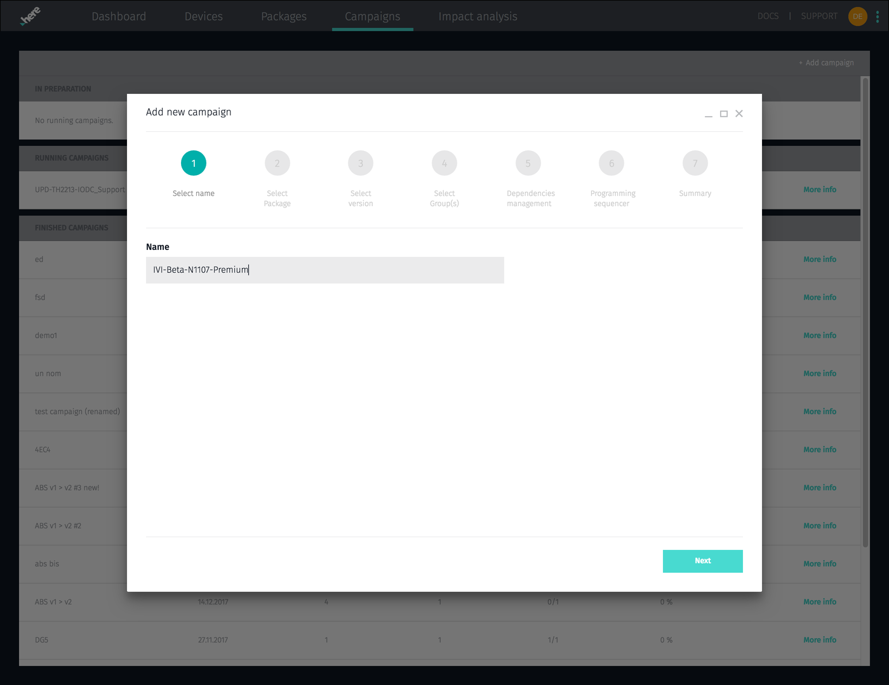
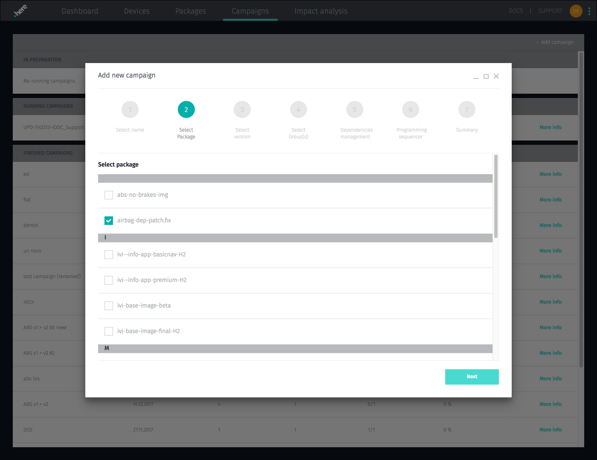
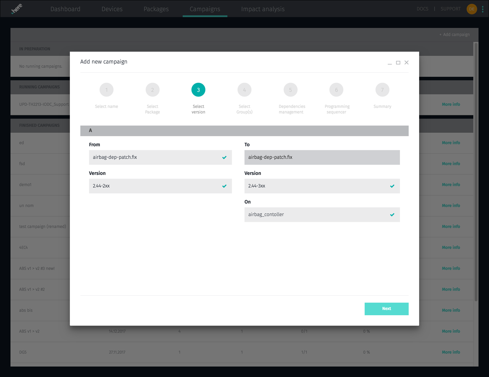
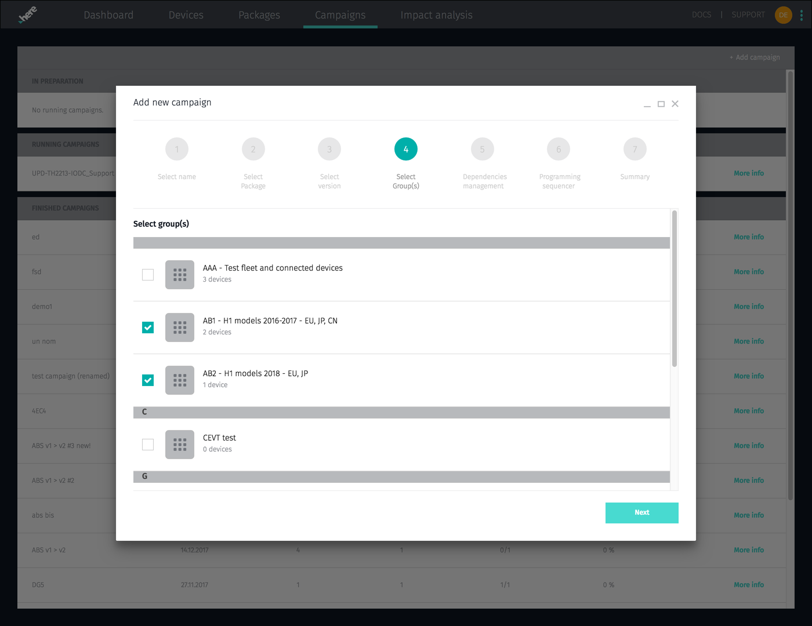
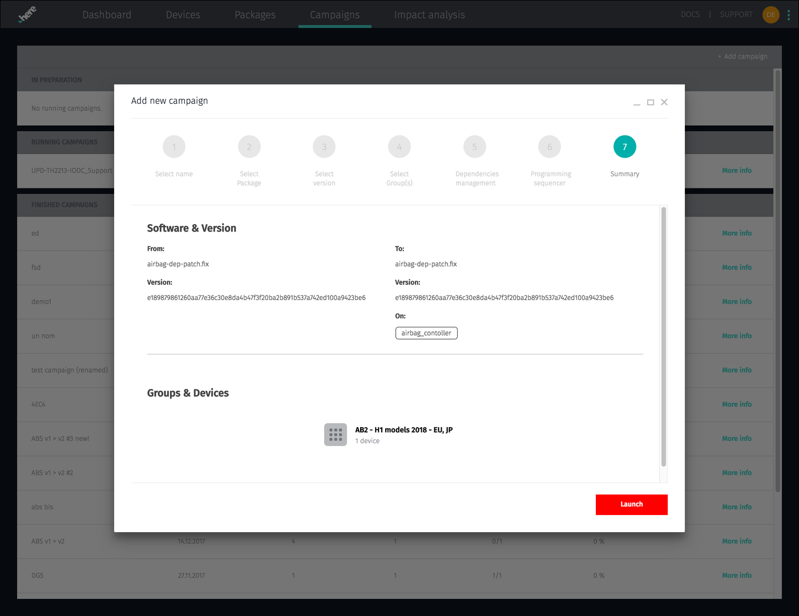
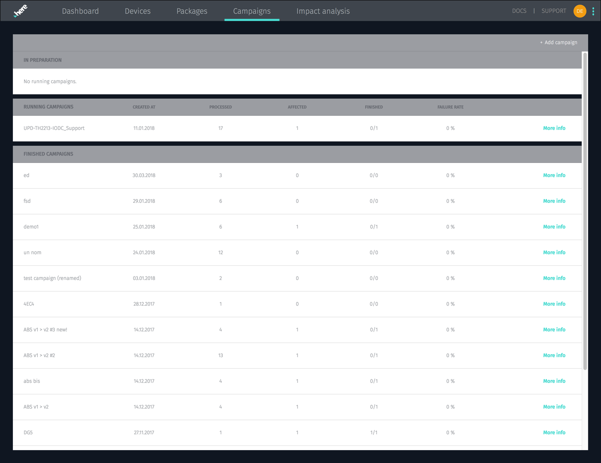
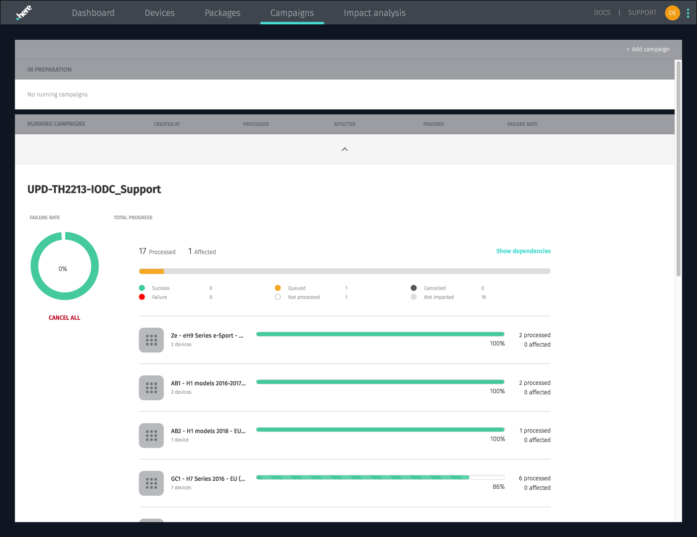

= Managing campaigns
:page-layout: page
:page-categories: [usage]
:page-date: 2017-06-07 13:51:54
:page-order: 2
:icons: font

{product-name} is built for managing update campaigns to fleets of devices in the field. The {app-url}/#/campaigns[*Campaigns*, window="_blank"] tab is where you create, monitor, and manage them. This brief video shows you how to create groups and update campaigns:

video::229845725[vimeo,854,480]

== Creating a campaign

To make a campaign, you need to:

* Give the campaign a name:

* Select a package or image to install:

* Select the version of the package you want to update from, the version to update to, and the affected ECUs/hardware IDs:

* Select the target group or groups of devices:

* Check the details selected, and launch the campaign:

== Monitoring campaign status

Once you have some campaigns created, your campaigns tab will show you the status of your running and completed campaigns:

You can click an individual campaign to see its status in more detail:

