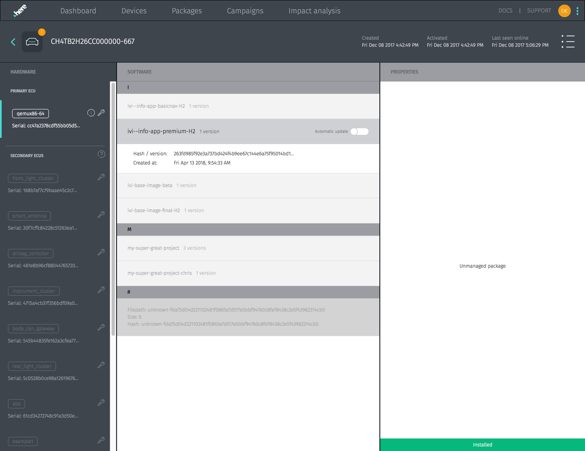

= Individual Device View
:page-layout: page
:page-categories: [usage]
:page-date: 2017-06-07 13:52:10
:page-order: 2
:icons: font

.Individual device page

On this page, you can:

* View information about the device, including:
** Hardware configuration and information
** Current software manifest
** Currently installed OSTree image
** Installation history and status
* Manually select packages/images to install
* Set a particular branch to automatically update as soon as it's built/pushed by bitbake
