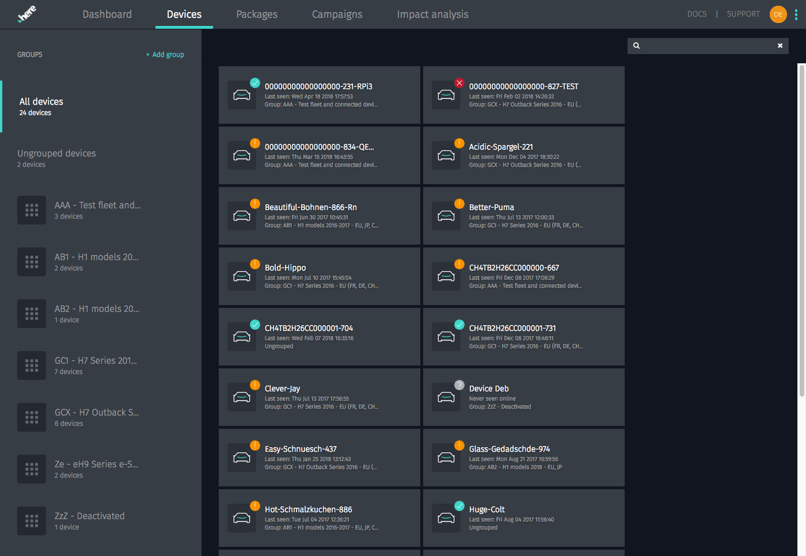

= Managing devices
:page-layout: page
:page-categories: [usage]
:page-date: 2017-06-07 13:51:37
:page-order: 1
:icons: font

.link:{app-url}/#/devices[Devices page, window="_blank"]

On this page, you can:

* Create groups
* Move devices into groups by dragging and dropping
* Rename devices
* Search through and filter your devices by name
* Click an individual device to go to its link:../usage/device-page.html[device page]
